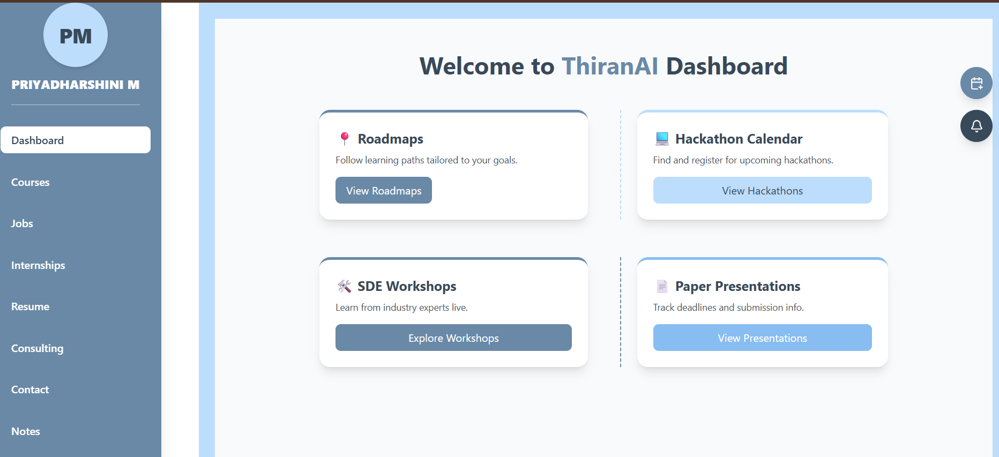
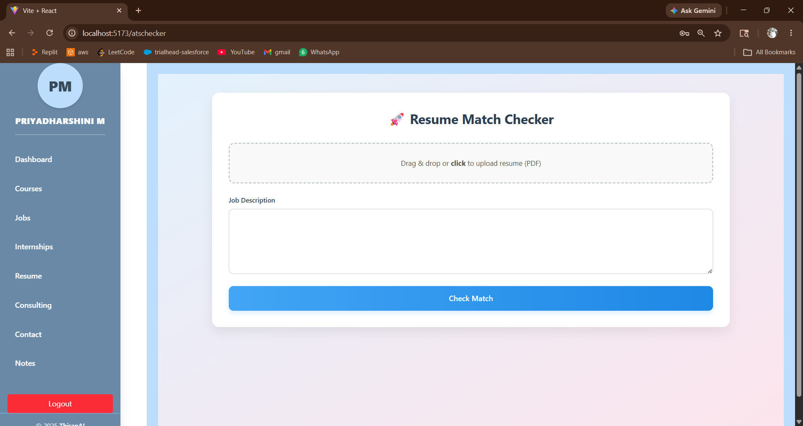
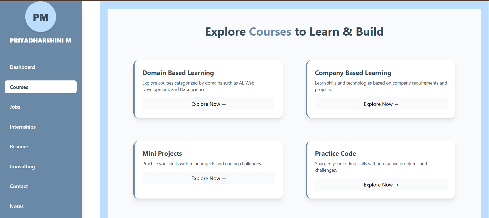

# 🚀 ThiranAI – AI for Employment Innovation

## 📖 Project Overview

ThiranAI is an AI-powered career development platform built to bridge the gap between students and employment opportunities. The platform provides intelligent career guidance, ATS-based resume analysis, personalized learning recommendations, job and internship discovery, coding practice resources, and AI-assisted support through a unified ecosystem.

The goal of ThiranAI is to help students identify skill gaps, improve their resumes, discover relevant opportunities, and prepare effectively for placements using data-driven recommendations and AI-powered insights.

---

## 🎯 Problem Statement

Many students struggle with:

* Understanding industry requirements and skill gaps
* Creating ATS-friendly resumes
* Finding relevant jobs and internships
* Choosing appropriate learning resources
* Tracking placement preparation progress

ThiranAI addresses these challenges by integrating Artificial Intelligence, Machine Learning, and Full-Stack Development into a single platform that guides users throughout their career preparation journey.

---

## 💡 Key Features

### 📄 ATS Resume Analyzer

Analyzes resumes and provides ATS compatibility scores, skill-gap identification, and personalized improvement suggestions.

### 🎯 AI-Based Job & Internship Recommendations

Recommends opportunities based on user skills, interests, and career goals using intelligent matching techniques.

### 📚 Personalized Learning Recommendations

Suggests courses, career roadmaps, and learning resources tailored to individual career aspirations.

### 🤖 AI Chatbot Assistant

Provides instant assistance, career guidance, and platform support through an interactive AI-powered chatbot.

### 📝 Mock Tests & Coding Practice

Offers placement preparation resources, assessments, and coding practice materials.

### 📊 Career Dashboard

Enables users to track learning progress, recommendations, tasks, and placement preparation activities.

---

## 🛠️ Technology Stack

### Frontend

* React.js
* JavaScript
* Tailwind CSS
* HTML5
* CSS3

### Backend

* FastAPI
* Python
* REST APIs
* JWT Authentication

### Database

* MongoDB

### Artificial Intelligence & Machine Learning

* Natural Language Processing (NLP)
* Resume Analysis
* Semantic Search
* Recommendation Systems
* Machine Learning Models

### Tools & Platforms

* Git
* GitHub
* Postman
* VS Code

---

## 🚀 Technical Highlights

* Developed a full-stack application using React.js and FastAPI.
* Designed RESTful APIs for seamless frontend-backend communication.
* Implemented JWT-based authentication and authorization.
* Integrated machine learning models for recommendation systems.
* Built an ATS resume evaluation module for career enhancement.
* Developed semantic search capabilities for intelligent content retrieval.
* Designed scalable MongoDB schemas for user and career data management.

---

## 📸 Application Screenshots

### 📊 User Dashboard

Centralized dashboard displaying career insights, recommendations, progress tracking, and personalized activities.

---

### 📄 ATS Resume Analysis

Resume evaluation module providing ATS score, skill assessment, and actionable improvement suggestions.

---

### 🎯 Job & Learning Recommendations

Personalized recommendations generated based on user profile, interests, and career goals.

---

### 🤖 AI Chatbot Assistant

Interactive AI assistant for career guidance, platform navigation, and user support.

---

## 📈 Future Enhancements

* AI Mock Interview Assistant
* Company-Specific Interview Preparation
* Advanced Resume Optimization
* Career Roadmap Generator
* LLM-Based Career Mentor
* Real-Time Job Market Analytics

---

## 👩‍💻 Developer

**Priyadharshini M**

GitHub: https://github.com/Priyadharshini511

---

## ⭐ Acknowledgement

If you found this project interesting, consider giving it a ⭐ on GitHub.
