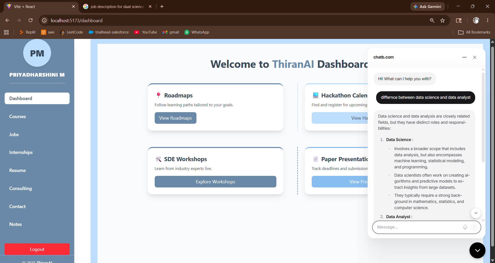

#  ThiranAI – AI for Employment Innovation

## 📌 Overview

ThiranAI is an AI-powered career development platform designed to help students and job seekers improve their employability through intelligent career guidance, ATS-based resume analysis, personalized learning recommendations, and job discovery. The platform combines Artificial Intelligence, Machine Learning, and Full-Stack Web Technologies to deliver a comprehensive career development ecosystem.

---

## ✨ Features

- ATS Resume Analysis & Scoring
- AI-Powered Job Role Matching
- Personalized Course Recommendations
- Resume & Document Management
- Task Management System
- Secure Authentication & Authorization
- Interactive User Dashboard
- Semantic Search & Recommendation Engine
- Career Progress Tracking

---

## 🛠️ Tech Stack

### Frontend
- React.js
- JavaScript
- HTML5
- CSS3
- Tailwind CSS

### Backend
- FastAPI
- Python
- REST APIs
- JWT Authentication

### Database
- MongoDB

### AI & Machine Learning
- NLP (Natural Language Processing)
- Semantic Search
- Recommendation Systems
- Resume Analysis

---

## 📸 Project Screenshots

### 1. Login & Authentication
Secure user registration and login system with authentication and access control.


---

### 2. User Dashboard
Interactive dashboard for managing tasks, recommendations, and career activities.


---

### 3. ATS Resume Analysis
AI-powered resume evaluation providing ATS score, skill assessment, and improvement suggestions.


---

### 4. Job & Learning Recommendations
Personalized job opportunities and learning recommendations based on user skills and career goals.


---

## 📂 Project Structure

```text
ThiranAI
│
├── frontend/
│   ├── src/
│   ├── public/
│   └── package.json
│
├── backend/
│   ├── routers/
│   ├── services/
│   ├── model/
│   ├── data/
│   ├── utils/
│   ├── requirements.txt
│   └── main.py
│
├── assets/
│   ├── login.png
│   ├── dashboard.png
│   ├── resume-analysis.png
│   └── recommendations.png
│
└── README.md
```

---

## ⚙️ Installation

### Clone Repository

```bash
git clone https://github.com/Priyadharshini511/ThiranAI.git
cd ThiranAI
```

### Backend Setup

```bash
cd backend
pip install -r requirements.txt
uvicorn main:app --reload
```

### Frontend Setup

```bash
cd frontend
npm install
npm run dev
```

---

## 🎯 Future Enhancements

- AI Mock Interview Assistant
- Career Roadmap Generator
- Company-Specific Preparation Modules
- Advanced Resume Optimization
- LLM-Powered Career Mentor

---

## 👩‍💻 Author

**Priyadharshini M**

- GitHub: https://github.com/Priyadharshini511


---

⭐ If you found this project interesting, consider giving it a star!

## 📸 Project Screenshots

### 1. User Dashboard
Interactive dashboard for managing career activities, learning progress, tasks, and recommendations.


---

### 2. ATS Resume Analysis
AI-powered resume evaluation providing ATS score, skill assessment, and personalized improvement suggestions.


---

### 3. Job & Learning Recommendations
Personalized job opportunities and course recommendations based on user skills, interests, and career goals.


---

### 4. Task Management System
Integrated productivity module enabling users to organize, track, and manage career development activities efficiently.



